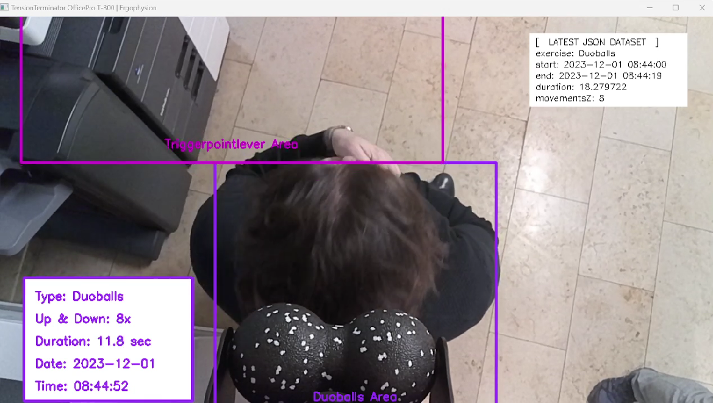
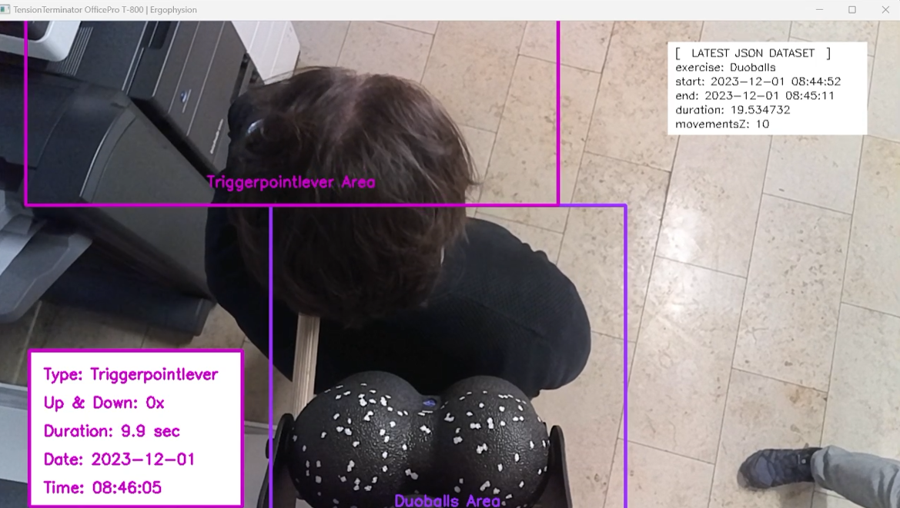
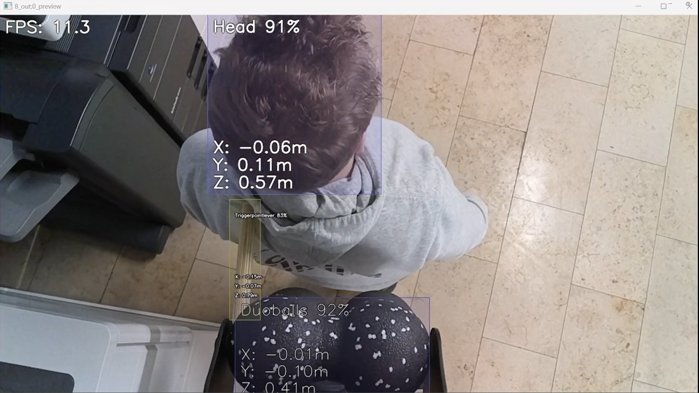

# TT800 Device Module

## Preconditions

### OAK-D Lite

We tested our code on a OAK-D Lite device connected to the host via USB. Host was Windows 11.
The OAK-D Lite is a USB-powered spatial AI camera system with a RGB camera, 2 Mono cameras and a Myriad X VPU. The OAK-D Lite is also compatible with the Raspberry Pi.
- [OAK-D Lite](https://shop.luxonis.com/products/oak-d-lite-1)

### DepthAI

You have to install the DepthAI SDK on your device. The DepthAI SDK is a Python library that enables you to easily access the DepthAI hardware. It provides a Python API for configuring and interacting with the DepthAI hardware, including the OAK-D camera. The DepthAI SDK also includes a set of functions for our pre-trained neural network models for object detection and spatial detection.

#### Linux and macOS (incl. Raspberry PI)
To install the DepthAI SDK on Linux and macOS, use the following pip command:
```
python3 -m pip install depthai-sdk
```

#### Windows
For Windows, the DepthAI SDK can be installed via pip as follows:
```
py -m pip install depthai-sdk
```

### References
- [DepthAI Documentation](https://docs.luxonis.com/en/latest/)
- [DepthAI SDK Docs](https://docs.luxonis.com/projects/sdk/en/latest/quickstart/#installation)


## TT800run Python Script for Device

This Python script 'TT800run.py' is the implementation for the Tension Terminator OfficePro running on a device, which is connected with the OAK-D camera. It leverages DepthAI SDK for spatial detection and operates with an EasyGUI interface on compatible devices. The script is structured to provide a comprehensive solution for exercise monitoring and data collection. 

### To run the script, execute the following command in the terminal:
```
python3 TT800run.py -fast
```

### Detailed breakdown of functionalities:

1. **Library Import and Global Variable Initialization**: 
   - The script begins by importing necessary libraries such as `os`, `sys`, `json`, `cv2`, `numpy`, `pathlib.Path`, and various DepthAI SDK components.
   - Global variables are defined to store exercise data and state information, including exercise type, duration, area, and various counters and flags.

2. **File Naming and JSON Structure Adjustment**:
   - A timestamp is generated to name output files in a structured manner, ensuring data consistency and ease of retrieval.
   - The script addresses a specific bug in YOLO8 model's JSON structure, where classes are incorrectly named, and provides a correct format for labeling.

3. **Model Selection and Command-Line Argument Handling**:
   - The script defaults to a 'slow' mode using Yolo5m and can switch to a 'fast' mode with Yolo8s based on command-line arguments, impacting object detection rate and processing speed.

4. **Label Loading and Data Appending Functions**:
   - `load_labels` function reads label information from the specified JSON model file.
   - `append_to_json_file` function appends new data entries to a JSON file, ensuring all exercise data is recorded and stored systematically.

5. **Neural Network Data Decoding and Screen Clearing Functions**:
   - The `decode` function processes NN data to extract detection results, including class, confidence, and coordinates.
   - `clear_screen` provides a clean visual slate for EasyGUI by clearing the terminal screen based on the operating system.

6. **Main Callback Function (`cb`) for Processing Detection Packets**:
   - This function is the core of the script, handling real-time data from the DepthAI camera and processing it for exercise monitoring.
   - It updates various counters and flags based on detection data and time intervals, tracking head movements and exercise areas.
   - The script dynamically updates exercise status, including type, duration, and spatial coordinates of detected objects.
   - Visual feedback is provided through the OpenCV interface, drawing rectangles and text on the camera frame to indicate detected areas and exercise data.
   - The function also ensures the exercise data is saved periodically and resets variables upon completion or interruption of an exercise.

7. **Camera and Neural Network Initialization with DepthAI SDK**:
   - The script initializes the OakCamera and sets up the color camera and neural network for YOLO object detection.
   - It employs a callback mechanism (`cb`) to process data from the neural network output and provides visual feedback.

8. **Camera Execution and Display**:
   - The script starts the camera in blocking mode, meaning it will continuously capture and process video frames until manually stopped.
   - Visual output is displayed using OpenCV, with options for resizing the frame for better visibility.


### Screenshots of the output of the TT800run.py script




###
###

## TTmodeltest Python Script for Device

This Python script demonstrates the use of the DepthAI SDK to operate different self-trained YOLO neural networks for spatial detection. It allows for dynamic selection of YOLO models (both YOLO 5 and YOLO 8 variants) with different configurations (small or medium, and varying image resolutions) based on command-line arguments. 
The main loop initializes the OakCamera, sets up a color camera and neural network based on the selected model, and starts live spatial detection, visualizing the neural network output. The script's continuous loop allows for ongoing detection, making it suitable for real-time spatial analysis in various applications.

### To run the script, execute the following command in the terminal:
```
python3 TTmodeltest.py -1
```

### Screenshot of the output of the TTmodeltest.py script

